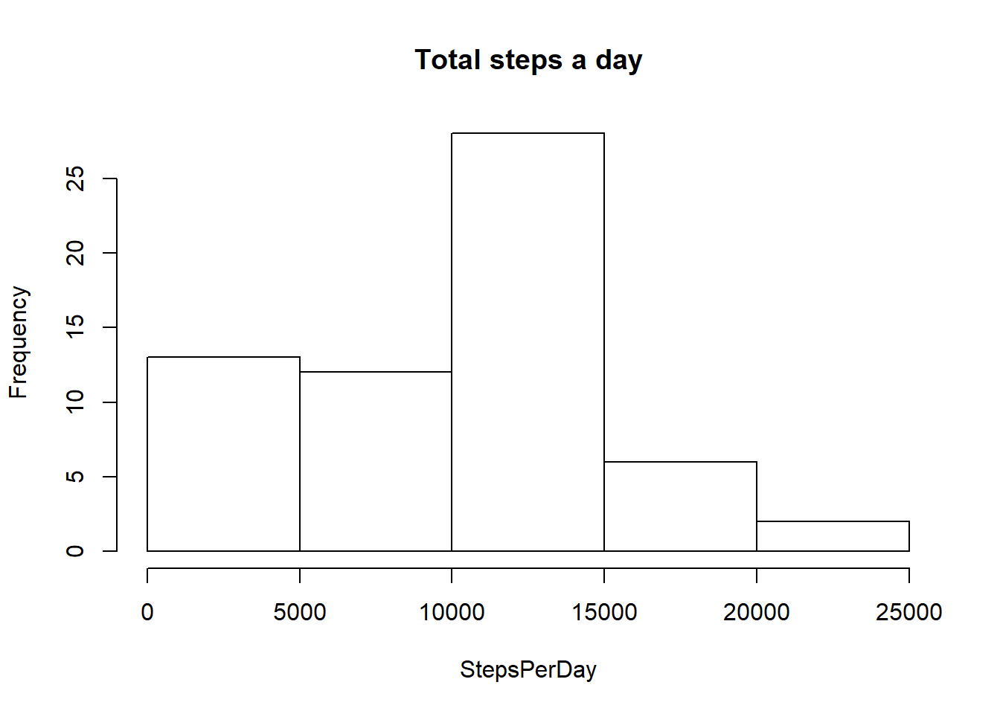
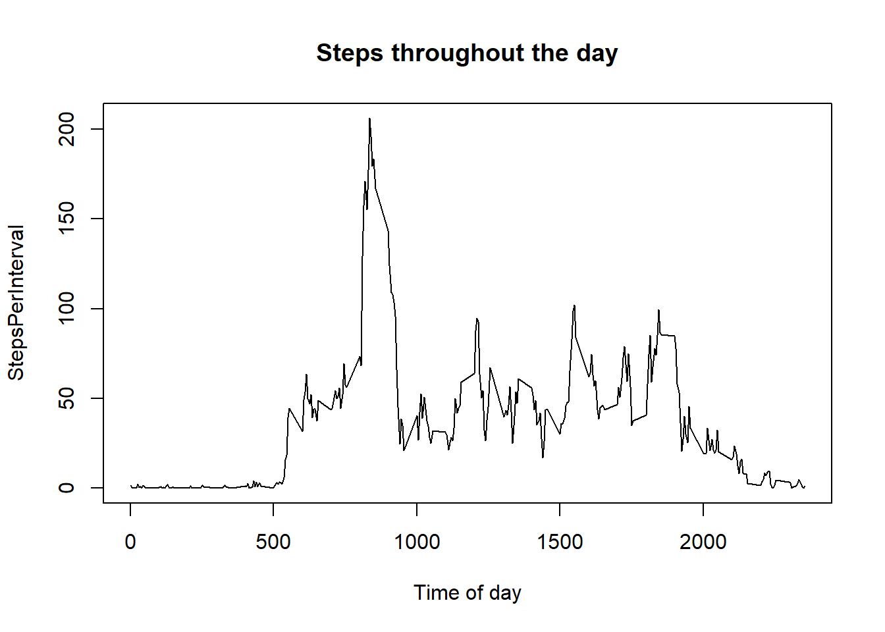
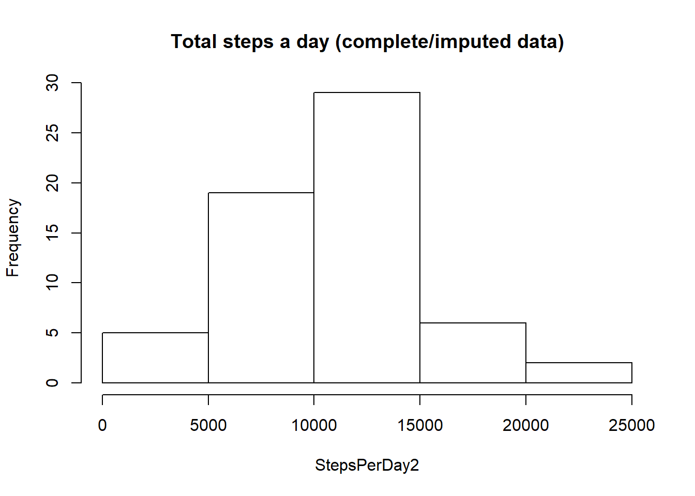
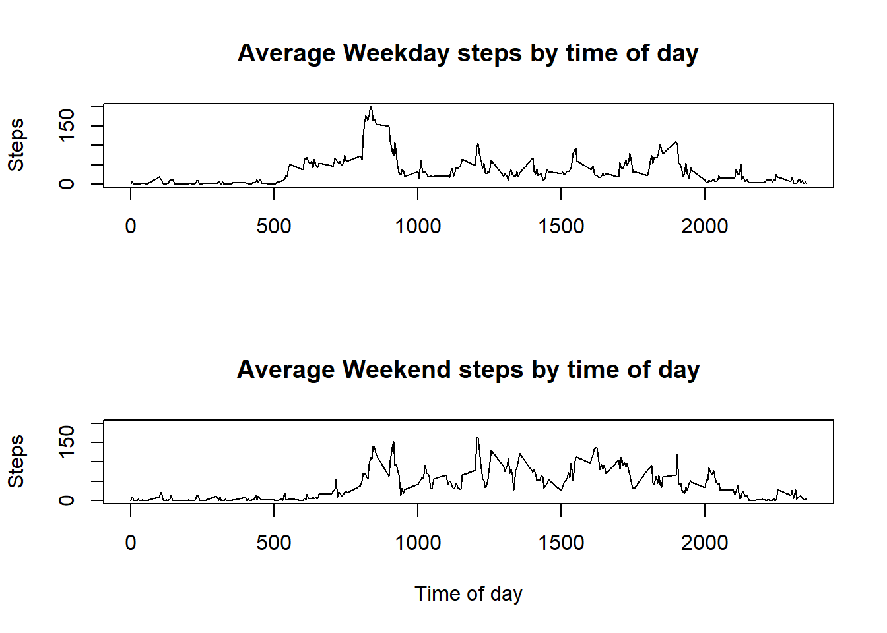

###First, let's load the data. 

```r
file<-"c:/Users/Sebastian/Google Drive/Education/Data Science/Coursera/Reproducible Research/RepData_PeerAssessment1/activity/activity.csv"
data<-read.csv(file, header=TRUE)
data2<-data[!is.na(data$steps),]
```


#What is mean total number of steps taken per day?

```r
StepsDay<-split(data2$steps, data2$date)
StepsPerDay<-sapply(StepsDay,sum)
Ans1.median<-quantile(StepsPerDay,0.5)
Ans1.mean<-sum(StepsPerDay)/length(unique(data2$date))

hist(StepsPerDay, main = "Total steps a day")
```

<!-- -->

###The average total number of steps is 10766.19. The median is 10395.


#What is the average daily activity pattern?

```r
StepsInterval<-split(data2$steps, data2$interval)
StepsPerInterval<-sapply(StepsInterval,mean)
plot(unique(data2$interval), StepsPerInterval, type="l", main="Steps throughout the day", xlab="Time of day")
```

<!-- -->

```r
maxdata<-cbind(unique(data2$interval), StepsPerInterval)
maxInterval<-maxdata[StepsPerInterval==max(StepsPerInterval),1]
```
###The plot above shows the average daily pattern. The most active interval is 835 as in 8:35AM.  


#Imputing Missing Values


```r
missingvalues<-nrow(data)-sum(complete.cases(data))
```
###There are 2304 incomplete cases in the original dataset. We can use the mice function to impute the missing values with predictive mean matching.  

```r
library(mice)
tempData <- mice(data,m=5,maxit=50,meth='pmm',seed=500)
completedData <- complete(tempData,1)
```

```r
StepsDay2<-split(completedData$steps, completedData$date)
StepsPerDay2<-sapply(StepsDay2,sum)
Ans3.median<-quantile(StepsPerDay2,0.5)
Ans3.mean<-sum(StepsPerDay2)/length(unique(completedData$date))

hist(StepsPerDay2, main = "Total steps a day (complete/imputed data)")
```

<!-- -->


###The average total number of steps is 10399.89. The median is 10439. Compare these results to those of the non-imputed data: 10766.19 (mean) and 10395 (median). Imputing the data decreases the mean but increases the median. 

#Are there differences in activity patterns between weekdays and weekends?


```r
completedData$date <- as.Date(completedData$date)
weekdays1 <- c('Monday', 'Tuesday', 'Wednesday', 'Thursday', 'Friday')
completedData$day <- factor((weekdays(completedData$date) %in% weekdays1), levels=c(FALSE, TRUE), labels=c('weekend', 'weekday') )
summary(completedData$day)
```

```
## weekend weekday 
##    4608   12960
```


```r
StepsIntervalwkday<-split(completedData$steps[completedData$day=="weekday"], completedData$interval)
StepsPerIntervalwkday<-sapply(StepsIntervalwkday,mean)
StepsIntervalwknd<-split(completedData$steps[completedData$day=="weekend"], completedData$interval)
StepsPerIntervalwknd<-sapply(StepsIntervalwknd,mean)
```


```r
par(mfrow=c(2,1))
plot(unique(completedData$interval), StepsPerIntervalwkday, type="l", ylim=c(0,200), xlab= "", main="Average Weekday steps by time of day", ylab="Steps")
plot(unique(completedData$interval), StepsPerIntervalwknd, type="l", ylim=c(0,200), xlab="Time of day", main="Average Weekend steps by time of day", ylab="Steps")
```

<!-- -->

###The plot above shows the average number of steps taken by the individual during weekdays (top) and weekend (bottom). There is an observable difference between the weekend and weekday. For example, the subject starts to take steps (i.e. wakes up) later in the day during the weekend compared to the weekday. There is also more activity (#steps) in the middle of the afternoon. 
